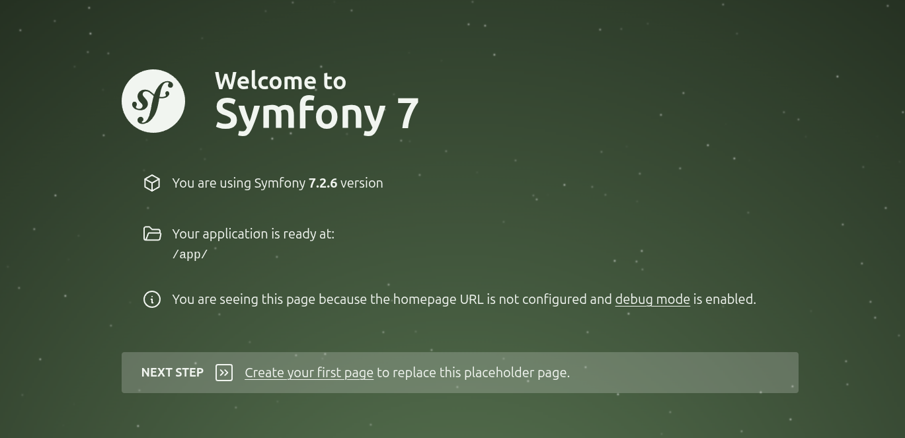
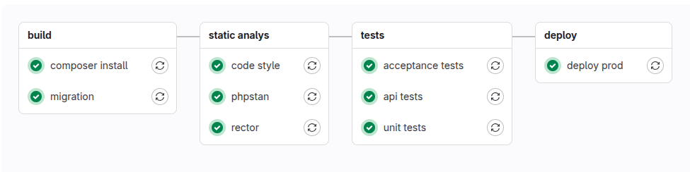

# Example Symfony 7.2 + PHP 8.4 + MySQL 9.3 + Nginx + Docker + CI/CD

Project template on stack:

- Symfony 7.2
- PHP 8.4
- MySQL 9.3
- Nginx
- Docker
- GitLab CI/CD

Tested on desktop Ubuntu 24 and VPS Ubuntu 24

## Local build

Requirements:

- Docker

Build:

`git clone https://github.com/WalkWeb/Symfony-7.2-PHP-8.4-MySQL-9.3-Nginx-Docker-CI-CD.git .`

`cp .env.example .env`

`docker compose up -d`

Added `127.0.0.1 app.loc` in `/etc/hosts`

Open `app.loc` or `0.0.0.0:80`:

## Server build and CI/CD

Requirements:

- Docker
- GitLab Account

1. Create new project repository
2. Change git remote origin repository to your GitLab project repository
3. Set up unauthorized access git pull (add `id_rsa.pub` in Account -> Preferences -> SSH Keys)
4. Set CI/CD variables (Settings -> CI/CD -> Variables):
    - $SSH_PRIVATE_KEY - Private key `id_rsa` (`id_rsa.pub` must set in `authorized_keys` in your server)
    - $SERVER_USER - user on your server
    - $SERVER_HOST - IP your server

5. Set up unauthorized access connect GitLab in your server (add server `id_rsa.pub` in Account -> Preferences -> SSH 
Keys)
6. Make changes to the main branch and check CI/CD (Project -> Build -> Pipelines):

